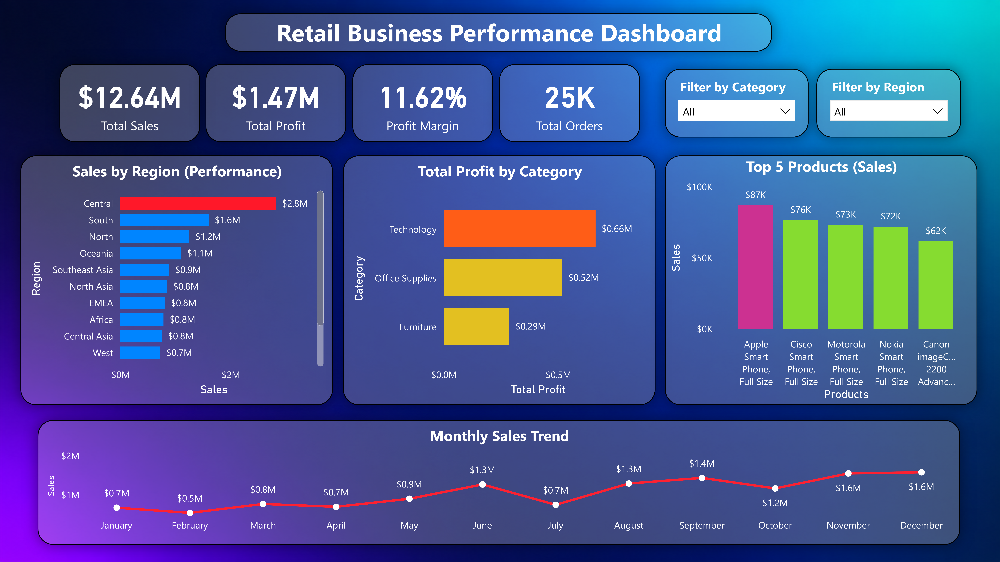

# Retail Sales & Profit Analysis & Prediction

## Project Overview
This project analyzes retail sales data to identify profitability trends, regional performance, product-level insights, and business factors affecting profit using Python, SQL, Machine Learning, and Power BI.

## Tools & Technologies
- Python
- Pandas
- NumPy
- Matplotlib
- Seaborn
- SQL
- Machine Learning
- Power BI

## Key Project Tasks
- Data Cleaning and Preprocessing
- Exploratory Data Analysis (EDA)
- Feature Engineering
- Regression Modeling
- Classification Modeling
- SQL Business Analysis
- Power BI Dashboard Development

## Machine Learning Models

### Regression Models
- Linear Regression
- Improved Decision Tree Regression
- Random Forest Regression

### Classification Models
- Decision Tree Classification
- KNN Classification
- SVM Classification

## Key Business Insights
- Higher discount levels were generally associated with lower profitability.
- Sales and discount were the most important features for predicting profit; shipping cost had comparatively lower importance.
- Technology achieved the highest sales and profit, while Office Supplies achieved the second-highest profit.
- Random Forest Regressor achieved the best performance among the tested regression models.
- Decision Tree Classifier achieved the highest classification accuracy.

## Power BI Dashboard

The Power BI dashboard provides interactive analysis of:
- Sales Performance
- Profitability Trends
- Regional Analysis
- Product Performance
- Monthly Sales Trends
